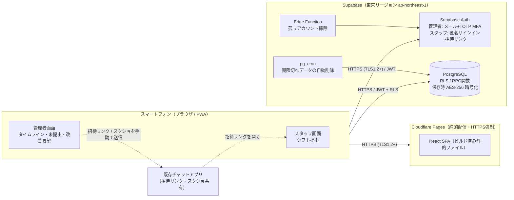
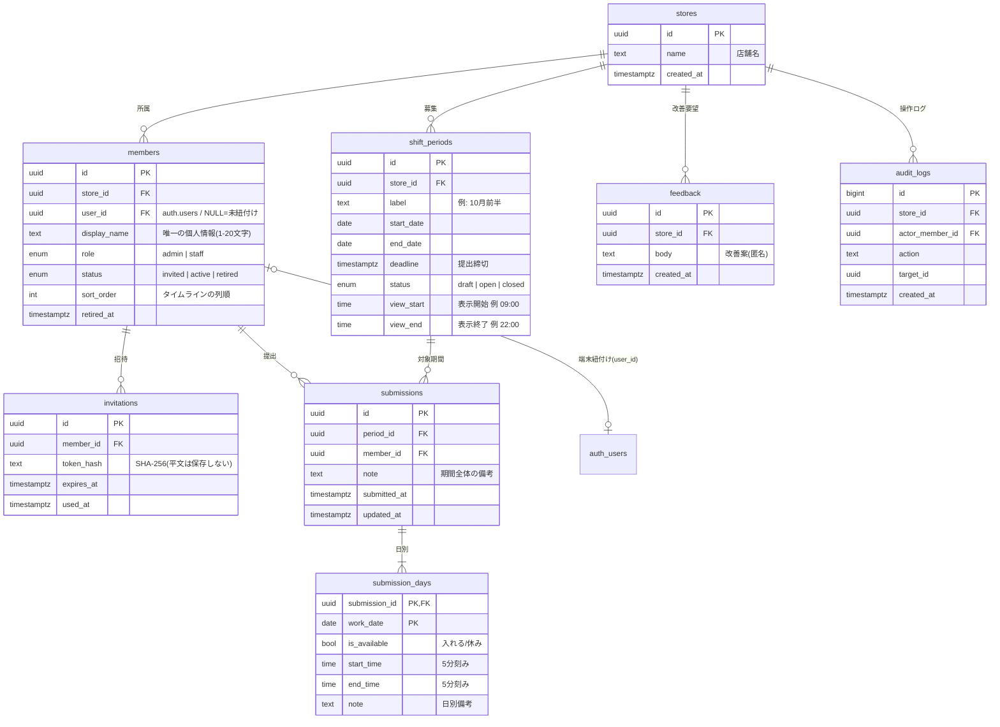
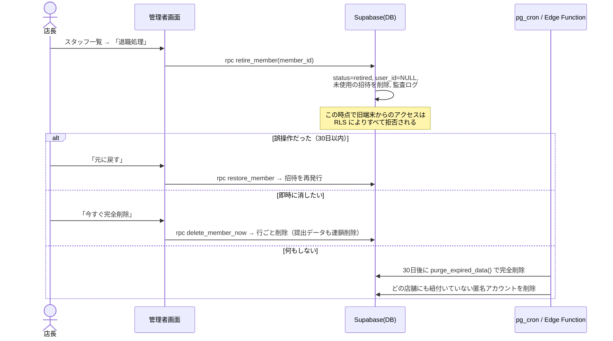
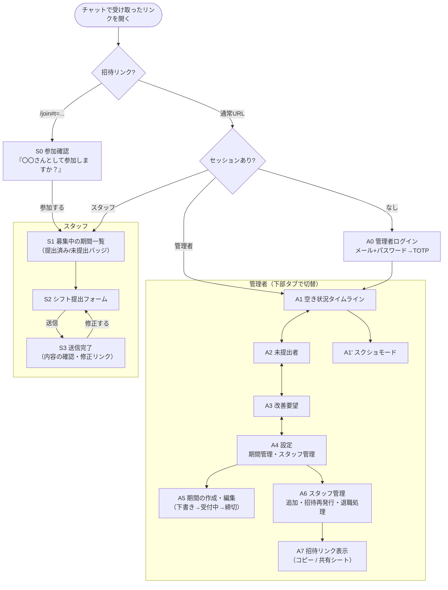

# シフト収集＆空き状況可視化システム 詳細設計書

| 項目 | 内容 |
| --- | --- |
| 対象 | 店舗のアルバイトシフト希望の収集・可視化（スマートフォン完結） |
| 利用者 | 管理者（店長）／スタッフ（アルバイト） |
| 版 | v0.1（2026-10-03 初版） |
| 関連ファイル | [`supabase/migrations/20261003000000_init.sql`](../supabase/migrations/20261003000000_init.sql)（テーブル定義・RLS・RPC の実装） |

## 0. 設計方針（要約）

- **作らないものは作らない。** 認証・DB・暗号化・バックアップは BaaS（Supabase）に任せ、自前で書くのは「画面」と「権限ルール（RLS）」だけにする。
- **連絡はチャットアプリのまま。** 本システムは「誰がいつ入れるか」の収集と可視化だけを担い、通知・連絡機能は持たない。招待リンクと完成したタイムラインのスクショを既存チャットで流す運用にする。
- **個人情報は「表示名」だけ。** スタッフのメールアドレス・電話番号・LINE ID なども保存しない。ログインは招待リンクで端末を紐付ける方式にする（後述）。
- **権限はDBで強制する。** 画面で隠すだけでなく、PostgreSQL の Row Level Security（RLS）で「スタッフは自分の行しか読めない」を保証する。アプリにバグがあっても他人のデータは返らない。

---

## 1. 推奨技術スタック・使用ツールと選定理由

### 1.1 構成図



### 1.2 採用ツール

| レイヤ | 採用 | 主な選定理由 |
| --- | --- | --- |
| DB・認証・API | **Supabase**（Pro プラン、東京リージョン） | PostgreSQL の **RLS** で行単位の権限分離をDB側で強制できる。認証（MFA・匿名サインイン）が組み込み。保存時暗号化（AES-256）・TLS・日次バックアップ・SOC 2 Type II 取得済み。データを国内リージョンに置ける。 |
| フロントエンド | **React + TypeScript + Vite**（PWA 化） | 静的ファイルだけで動くため、サーバー運用が不要。ホーム画面に追加すればアプリのように使える。 |
| UI | Tailwind CSS ＋ 自作コンポーネント | Googleフォーム風の単純なUIなら UI ライブラリは不要。依存を減らすことは脆弱性対策にもなる。 |
| ジェスチャー | `@use-gesture/react` | タイムラインのピンチ拡大・縮小。 |
| ホスティング | **Cloudflare Pages** | 商用利用でも無料枠で足りる。HTTPS 自動・HSTS・セキュリティヘッダを `_headers` ファイルで設定できる。 |
| ボット対策 | Cloudflare Turnstile（Supabase Auth の CAPTCHA 連携） | 匿名サインインの乱用を防ぐ。 |
| 定期処理 | Supabase `pg_cron` ＋ Edge Function | 退職者・古いシフトデータの自動削除。 |

**ランニングコストの目安**：Supabase Pro 約 $25/月（1組織で複数店舗を収容可）＋ Cloudflare Pages 無料。Supabase の Free プランは一定期間アクセスがないと一時停止され、バックアップも付かないため、企業提供では Pro 以上を前提とする。

### 1.3 比較検討した他案と不採用理由

| 候補 | 評価 | 不採用理由 |
| --- | --- | --- |
| AppSheet / Glide | △ | スタッフ全員に Google アカウント（＝メールアドレス）でのログインが必要で、データ最小化の要件に反する。縦軸＝時間・横軸＝スタッフのガントチャートやピンチ操作をこの通りには作れない。 |
| Kintone | △ | 1ユーザーごとにライセンス費用がかかり、アルバイト全員分だと割高。スマホ向けのガントチャートはプラグイン頼みになる。 |
| Bubble | △ | UI の自由度は高いが、権限ルールが独自形式で監査しにくい。データ所在地を細かく選べない。 |
| Googleフォーム＋スプレッドシート | × | 回答者を確実に本人と確認できない。シートの共有設定を誤ると全員分が見える。5分刻みの時刻入力も強制できない。 |
| **Firebase**（Auth＋Firestore） | ○（次点） | 匿名認証＋セキュリティルールで同じ構成は作れる。ただし「期間×スタッフ×日」の集計や未提出者の抽出はリレーショナルDB（SQL）の方が素直に書ける。また Supabase の RLS は SQL でルールのテストを書きやすい。 |
| LINE ミニアプリ / LIFF | △ | 既存チャットとの親和性は高い。ただし LINE のユーザーID・プロフィール画像など、本来不要な識別子を取得することになる。チャットアプリが LINE に固定されている場合に限り、将来の拡張候補とする。 |

### 1.4 認証方式の設計（データ最小化の中心）

| 利用者 | 方式 | 保存する情報 |
| --- | --- | --- |
| 管理者（店長） | メール＋パスワード ＋ **TOTP 多要素認証（必須）**。アカウントは運営側が発行し、一般のサインアップは無効にする。 | 店舗の業務用メールアドレス（個人アドレスは使わない運用）、表示名 |
| スタッフ | ① 管理者が表示名だけを登録 → ② システムが**1回限り・72時間有効の招待リンク**を発行 → ③ 管理者がチャットの**個別トーク**で本人に送る → ④ 本人が開くと匿名サインインが行われ、その端末が本人に紐付く | 表示名のみ（メール・電話番号なし） |

- 招待トークンは 192bit の乱数。DBには **SHA-256 ハッシュだけ**を保存し、平文は発行した瞬間に一度だけ管理者の画面に表示する。
- 機種変更やブラウザのデータ消去でログインが外れた場合は、管理者が招待リンクを再発行する。再発行した時点で旧端末の紐付けは解除される。
- 招待リンクを他人に使われた場合は、本人が開いたときに「使用済み」と表示されるため気付ける。管理者画面には「参加済み（紐付け日時）」を表示し、心当たりがなければ再発行する。

---

## 2. データモデル

### 2.1 ER図



### 2.2 テーブル定義の要点

| テーブル | 役割 | 主な制約・設計判断 |
| --- | --- | --- |
| `stores` | 店舗（テナント） | すべての業務データは `store_id` で店舗ごとに分離する（マルチテナント）。 |
| `members` | 管理者・スタッフ | **個人情報は `display_name` のみ**。`user_id` は認証基盤の内部ID（ランダムUUID）で、個人を特定する情報ではない。1つのログインは1店舗にのみ所属する。 |
| `invitations` | 招待リンク | `token_hash` のみ保存。RLS で全操作を拒否し、RPC 関数経由でしか読み書きできない。 |
| `shift_periods` | 募集期間 | 期間は最大32日（「前半」「後半」「月」を想定）。`draft` の期間はスタッフから見えない。`open` の間だけ提出・修正できる。 |
| `submissions` | 期間ごとの提出（1人1期間1件） | `UNIQUE(period_id, member_id)`。再提出は上書き（`updated_at` を更新）。 |
| `submission_days` | 日別の可否と時間 | CHECK 制約で「休みなら時刻なし」「入れるなら開始＜終了、分が5の倍数、秒は0」をDBが保証する。期間に含まれない日付は RPC で拒否する。日をまたぐ勤務（22:00〜翌2:00など）は v1 の対象外（終了の上限は 24:00）。 |
| `feedback` | サイト改善案 | **提出者を記録しない（匿名）**。率直な意見を集めやすくするためと、不要な紐付け情報を持たないため。 |
| `audit_logs` | 管理操作の記録 | 招待の発行、退職処理、削除などを記録する。対象者の氏名は書かず、IDだけを残す（削除後は追跡できなくなる）。 |

### 2.3 データ保持期間（自動削除）

| データ | 保持期間 | 削除方法 |
| --- | --- | --- |
| 退職処理済みスタッフ（`retired`） | 退職処理から30日（誤操作の取り消し猶予） | `pg_cron` で日次削除（提出データも連鎖削除）。「今すぐ完全削除」ボタンで即時削除も可能。 |
| 募集期間と提出データ | 期間終了から180日 | `pg_cron` で日次削除 |
| 改善要望 | 投稿から1年 | `pg_cron` で日次削除 |
| 未使用の招待リンク | 有効期限切れの時点 | `pg_cron` で日次削除 |
| 店舗に紐付いていない匿名アカウント | 作成から7日 | Edge Function（Auth Admin API）で日次削除 |

---

## 3. セキュリティ対策の実装方針

### 3.1 要件との対応表

| 要件 | 実装 |
| --- | --- |
| 個人情報の最小化 | 列として持つ個人情報は `display_name` だけ（スキーマに電話・住所・生年月日の列が存在しない）。スタッフ認証にメールを使わない。改善要望は匿名。アクセス解析・広告タグなど外部スクリプトは入れない。 |
| 権限分離 | `members.role`（admin / staff）と RLS。管理者の権限は **MFA 済みセッション（`aal2`）であることを条件**にしているため、パスワードだけが漏れても管理者データは読めない。 |
| スタッフは自分の提出のみ | RLS で `submissions` と `submission_days` の読み取りを本人と管理者に限定する。書き込みは RPC `submit_shift` のみで、提出者IDはクライアントから受け取らず `auth.uid()` から決める（他人になりすました提出ができない）。 |
| 他人の個人情報を見せない | `members` の読み取りは「自分の行」と「同じ店舗の管理者」のみ。スタッフ画面には他のスタッフの名前すら表示されない。 |
| 管理者のみ全体閲覧 | タイムライン・未提出者一覧・改善要望は `is_store_admin()` を満たすときだけ行が返る。 |
| 通信の暗号化 | Cloudflare Pages と Supabase はどちらも HTTPS のみ。`Strict-Transport-Security` を付与する。Supabase の DB 直接接続は SSL を必須にする（SSL Enforcement を有効化）。 |
| 保存データの保護 | Supabase は保存時に AES-256 で暗号化される。東京リージョンを選び、データを国内に保持する。バックアップも暗号化される。招待トークンはハッシュ化して保存する。 |
| 退職者の無効化・削除 | 管理者画面の「退職処理」で即座にアクセス不能にする（`user_id` の紐付け解除＋未使用の招待を削除）。30日後に自動で完全削除し、「今すぐ完全削除」も用意する。手順は 3.4 を参照。 |

### 3.2 RLS（行レベルセキュリティ）ポリシー一覧

基本方針：**全テーブルで RLS を有効にし、`anon` ロールには一切の権限を与えない。書き込みは原則 `SECURITY DEFINER` の RPC 関数に集約する。** 関数は入力値と権限をすべて自分で検証し、`search_path` は空に固定する。

| テーブル | SELECT | INSERT / UPDATE / DELETE |
| --- | --- | --- |
| `stores` | 所属メンバー | 不可（RPC `create_store` のみ） |
| `members` | 自分の行／同じ店舗の管理者 | UPDATE は管理者のみ、かつ `display_name` と `sort_order` の列だけ（列単位 GRANT）。作成・退職・削除は RPC。 |
| `invitations` | **全拒否** | **全拒否**（RPC のみ） |
| `shift_periods` | 同じ店舗のメンバー（`draft` は管理者のみ） | 管理者のみ |
| `submissions` | 本人／同じ店舗の管理者 | 不可（RPC `submit_shift` のみ） |
| `submission_days` | 親の `submissions` が見える場合のみ | 不可（RPC `submit_shift` のみ） |
| `feedback` | 同じ店舗の管理者 | 不可（RPC `submit_feedback` のみ） |
| `audit_logs` | 同じ店舗の管理者 | 不可（RPC 内部でのみ記録） |

主要な RPC 関数（実装は SQL マイグレーションを参照）：

| 関数 | 呼び出せる人 | 処理 |
| --- | --- | --- |
| `create_store(store_name, admin_display_name)` | MFA 済みで、どの店舗にも未所属の管理者アカウント | 店舗と管理者メンバーを作成する |
| `add_staff(display_name)` | 管理者 | スタッフを作成し、招待トークン（平文）を一度だけ返す |
| `issue_invitation(member_id)` | 管理者 | 招待を再発行する。旧端末の紐付けは解除される。 |
| `redeem_invitation(token)` | ログイン中の端末（匿名可） | トークンを照合し、端末をメンバーに紐付ける |
| `submit_shift(period_id, note, days)` | 有効なスタッフ本人 | 受付中の期間か、日付が期間内かを検証し、提出内容を丸ごと置き換える |
| `submit_feedback(body)` | 有効なメンバー | 改善要望を匿名で登録する |
| `unsubmitted_members(period_id)` | 管理者（RLS に従って結果が絞られる） | 未提出者の一覧 |
| `retire_member(member_id)` / `restore_member(member_id)` / `delete_member_now(member_id)` | 管理者 | 退職処理／取り消し／即時完全削除 |
| `purge_expired_data()` | `pg_cron` のみ | 保持期間を過ぎたデータを削除する |

### 3.3 アプリケーション層の対策

- **鍵の管理**：フロントエンドには公開用の `anon` キーだけを置く（RLS があるので公開しても安全）。`service_role` キーは Edge Function の環境変数にだけ置き、リポジトリには入れない。
- **セキュリティヘッダ**（Cloudflare Pages の `_headers` で設定）：
  - `Content-Security-Policy: default-src 'self'; connect-src 'self' https://<project>.supabase.co wss://<project>.supabase.co; script-src 'self' https://challenges.cloudflare.com; frame-src https://challenges.cloudflare.com; img-src 'self' data:; style-src 'self' 'unsafe-inline'; frame-ancestors 'none'`
  - `Strict-Transport-Security: max-age=63072000; includeSubDomains; preload`
  - `Referrer-Policy: no-referrer`（招待トークンが外部サイトへ漏れないようにする）
  - `X-Content-Type-Options: nosniff`、`Permissions-Policy: camera=(), microphone=(), geolocation=()`
- **招待トークンの扱い**：URL の `#fragment` 部分に入れる（`https://app.example.com/join#t=xxxx`）。フラグメントはサーバーへ送られないため、アクセスログに残らない。読み取ったらすぐ `history.replaceState` で URL から消す。
- **XSS**：備考や改善案は React のテキストとして描画し、`dangerouslySetInnerHTML` は使わない。DB 側でも文字数の上限を CHECK 制約で設けている。
- **セッション**：Supabase Auth の Refresh Token Rotation を有効にする。管理者の JWT の有効期限は1時間。スタッフは端末に保存したセッションで長期間ログインしたままにできるが、退職処理や招待の再発行をすれば、その時点で RLS によりアクセスできなくなる。
- **乱用対策**：匿名サインインに Turnstile を必須にする。Supabase Auth のレート制限は既定値を維持する。
- **依存ライブラリ**：Dependabot と `npm audit` を CI で実行する。依存は最小限にする。

### 3.4 退職者対応フロー



### 3.5 運用上のルール（導入時に店舗へ渡す）

1. 表示名は「名字＋名の頭文字」など、店舗内で区別できる最小限のものにする（フルネームは不要）。
2. 招待リンクは**グループではなく個別トーク**で送る。
3. タイムラインのスクショをグループに貼るときは、その日に必要な範囲だけにする（スクショモードは日付単位で出力する）。
4. 店長の交代時は、新店長の管理者アカウントを発行してから旧店長のアカウントを無効化する。

### 3.6 検証方針

- RLS のテストを `supabase test db`（pgTAP）で書き、「スタッフAとしてログインするとスタッフBの `submissions` が0件」「MFA 前の管理者は全件0件」「匿名ユーザーは全テーブル0件」を CI で確認する。
- リリース前に Supabase の Security Advisor（RLS の付け忘れ、`search_path` 未固定の関数を検出する）で警告がゼロであることを確認する。

---

## 4. 主要な画面遷移図（UIフロー）

### 4.1 全体の画面遷移



### 4.2 S2 スタッフ向け：シフト提出フォーム（Googleフォーム風）

縦スクロールのみ。1画面に1列のカードを並べる。

```
┌──────────────────────────┐
│ ○○店 シフト希望             │  ← 固定ヘッダ（店舗名）
├──────────────────────────┤
│ 対象期間                     │
│ [ 10月前半 (10/1〜10/15) ▼ ] │  ← 受付中の期間のみ選択可
│ 締切: 9/25(木) 23:59          │
├──────────────────────────┤
│ 10/1 (水)                    │
│  [  休み  ] [■ 入れる ]      │  ← 2択のセグメントボタン（未選択も可）
│  ┌ 開始 [ 17:05 ] ┐          │  ← 「入れる」の時だけアコーディオンで展開
│  └ 終了 [ 22:00 ] ┘          │     タップでネイティブのドラムロールが開く
│  備考（任意）[            ]  │
├──────────────────────────┤
│ 10/2 (木)                    │
│  [■ 休み  ] [  入れる ]      │
├──────────────────────────┤
│   … 15日分 …                 │
├──────────────────────────┤
│ 期間全体の備考（任意）       │
│ [                          ] │
├──────────────────────────┤
│ 💡 このサイトの改善案を募集  │  ← 必須で最下部に設置（匿名と明記）
│ [                          ] │
│ ※ 名前は記録されません       │
├──────────────────────────┤
│ [        送信する        ]   │  ← 画面下に固定。未選択の日数を表示
└──────────────────────────┘
```

UI 仕様：

- **トグル**：「休み」「入れる」の2ボタンのセグメント（各ボタンの高さ 44px 以上）。初期状態は未選択で、送信時に未選択の日があれば「◯日が未選択です（休みとして送信しますか？）」と確認する。
- **アコーディオン**：「入れる」を押すと時間入力が `grid-template-rows: 0fr → 1fr` のアニメーションで開く。「休み」に戻すと時刻は送信データから除外する（DB の CHECK 制約とも整合）。
- **時刻入力（5分刻み）**：`<input type="time" step="300" min="05:00" max="24:00">` を使い、iOS・Android 標準のドラムロール（ホイール）を呼び出す。
  - 注意：iOS Safari は `step` を無視して1分刻みのホイールを表示する。そのため `change` イベントで**最も近い5分に丸め**、丸めた場合は「17:03 → 17:05 に調整しました」と小さく表示する。サーバー側（CHECK 制約）でも5分刻みを強制するので、不正な値は保存されない。
  - 入力を速くするため「前日と同じ」ボタンと、よく使う時間帯のチップ（例：`17:00-22:00`）を付ける（任意機能）。
- **途中保存**：入力内容は端末の `localStorage` に下書きとして保持し、送信が成功したら消す（サーバーには送信時にしか送らない）。
- **再提出**：締切前なら S1 から開き直して修正できる。フォームには前回の内容が入った状態で開く。

### 4.3 A1 管理者向け：空き状況タイムライン

```
┌───────────────────────────┐
│ ◀ 10/3(金) ▶  10月前半   📷 │  ← 日付の切替（左右スワイプも可）/ スクショモード
├────┬─────┬─────┬─────┬────┤
│    │山田 │佐藤 │鈴木 │田中│  ← スタッフ名（上部に固定）
├────┼─────┼─────┼─────┼────┤
│ 9:00│     │     │░░░░░│    │
│     │     │     │░休み░│    │
│10:00│     │█████│░░░░░│ 未 │
│     │     │█████│░░░░░│ 提 │
│11:00│     │█10:00│░░░░░│ 出 │
│ …  │     │ -14:30     │    │
│17:00│█████│     │     │    │
│     │█17:05     │     │    │
│ …  │█-22:00    │     │    │
│22:00│█████│     │     │    │
├────┴─────┴─────┴─────┴────┤
│ 入れる人数 9時▁▂▃▅▃▂▅▇▅▃ 22時 │  ← 時間帯ごとの人数（任意）
├───────────────────────────┤
│ [タイムライン] [未提出] [改善要望] [設定] │  ← 下部タブ
└───────────────────────────┘
```

UI 仕様：

- **軸**：縦軸＝時間（期間ごとに設定した `view_start`〜`view_end`、既定は 9:00〜22:00）、横軸＝スタッフ（`sort_order` 順）。時刻の列は左に、スタッフ名の行は上に固定（`position: sticky`）。
- **表示の区別**：入れる＝単色の塗りつぶしバーに開始・終了時刻を表示。休み＝薄いグレーの斜線。未提出＝列全体を薄いグレーにして「未提出」と表示。備考がある場合はバーに 💬 を付け、タップで全文を表示する。
- **ピンチ操作**：`@use-gesture/react` の `usePinch` で「1分あたりのピクセル数」と「列の幅」を変える（倍率 0.5〜4 倍）。ページ全体を CSS の `scale` で拡大すると文字がぼやけるため、描画し直す方式にする。目盛りは倍率に応じて 1時間 → 30分 → 15分 → 5分 と細かくする。ブラウザ自体のズームはこの描画エリア内だけ `touch-action: none` で抑え、他の画面では拡大を禁止しない（アクセシビリティのため）。
- **スクショしやすさ（A1' スクショモード）**：📷 を押すと、タブ・ボタン類を隠し、選択中の日の全時間帯が1画面に収まる倍率に自動で合わせる。上部に「○○店 10/3(金) 空き状況（10/1 21:30 時点）」を表示する。配色は白背景＋1色（例：青 `#2563EB`）＋グレーのみで、ダークモードの端末でも常にこの配色で表示する（チャットで見たときの見え方を揃えるため）。
- **描画方式**：DOM（CSS Grid）＋絶対配置のバーで描画する（スタッフ数十人×1日分なら Canvas は不要）。データは選択中の期間について1回だけ取得し、日付の切替はクライアント側で行う。

### 4.4 A2 未提出者 ／ A3 改善要望 ／ A6 スタッフ管理

- **A2 未提出者**：期間を選ぶと `unsubmitted_members()` の結果を一覧表示する。「名前をコピー」ボタンで「未提出: 山田、田中」という文字列をクリップボードにコピーし、チャットへの催促に貼り付けられるようにする（本システムからは通知を送らない）。
- **A3 改善要望**：新しい順のカード一覧（投稿日と本文のみ。投稿者は記録していない）。未読バッジを表示する（既読状態は端末内に保存）。
- **A6 スタッフ管理**：一覧に状態（招待中／参加済み／退職処理済み・削除まで残り◯日）を表示する。並び替えはドラッグで `sort_order` を更新する。「退職処理」は確認ダイアログで表示名を入力させて誤操作を防ぐ。

---

## 5. 実装ロードマップ（参考）

| フェーズ | 内容 | 目安 |
| --- | --- | --- |
| 1 | Supabase プロジェクト作成（東京）、マイグレーション適用、RLS の pgTAP テスト | 2日 |
| 2 | 認証（管理者 MFA、招待リンク）、S0〜S3 スタッフ画面 | 4日 |
| 3 | A1 タイムライン（ピンチ・スクショモード）、A2・A3 | 5日 |
| 4 | A4〜A7 管理系、自動削除ジョブ、セキュリティヘッダ、PWA 化 | 3日 |
| 5 | 1店舗で試験運用し、改善要望欄の意見を反映 | 2週間 |
