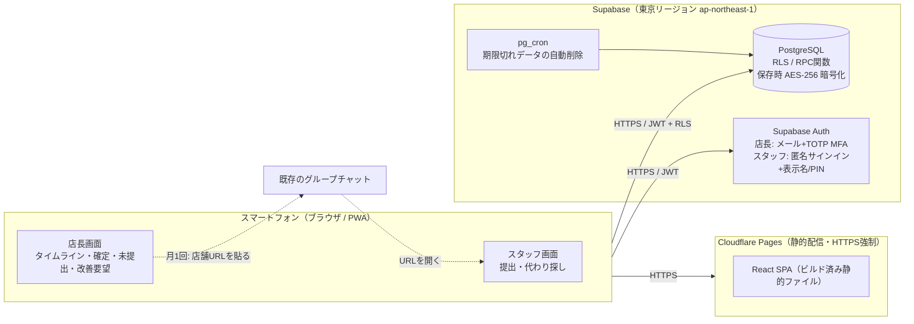
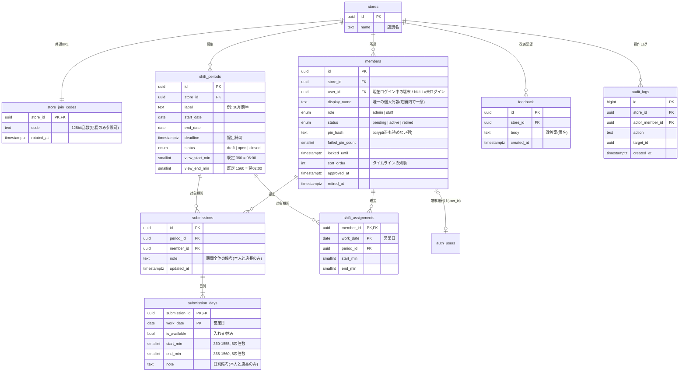
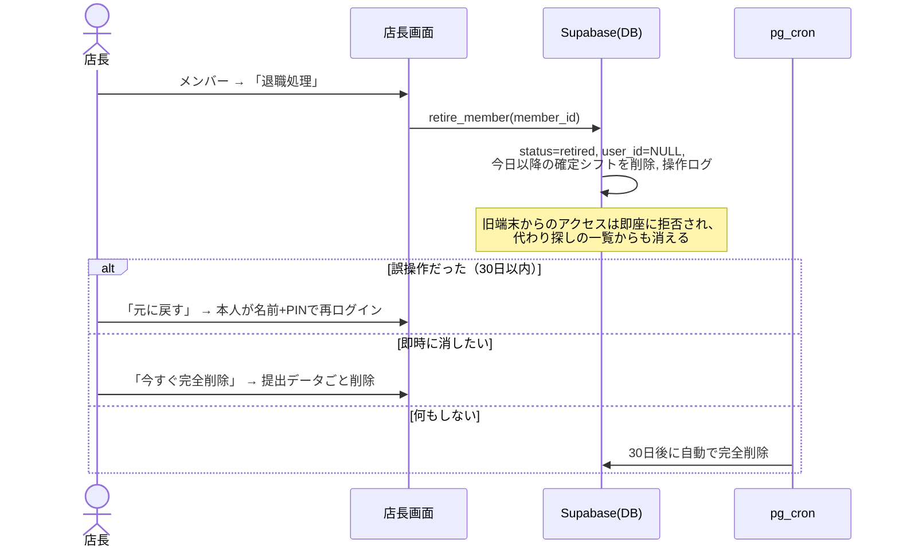
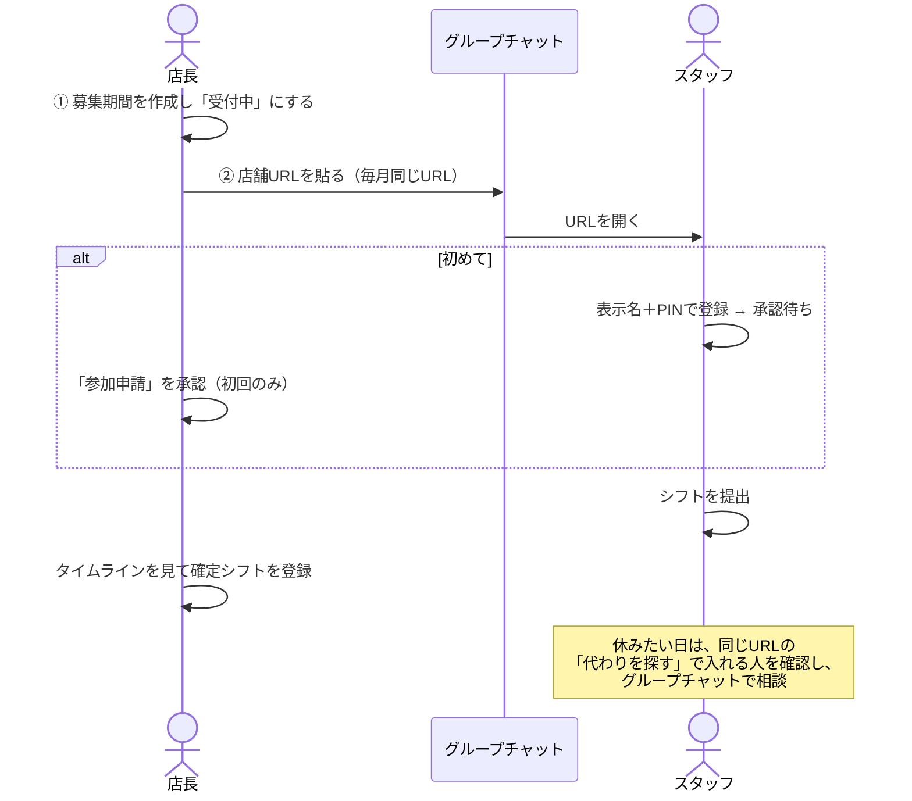
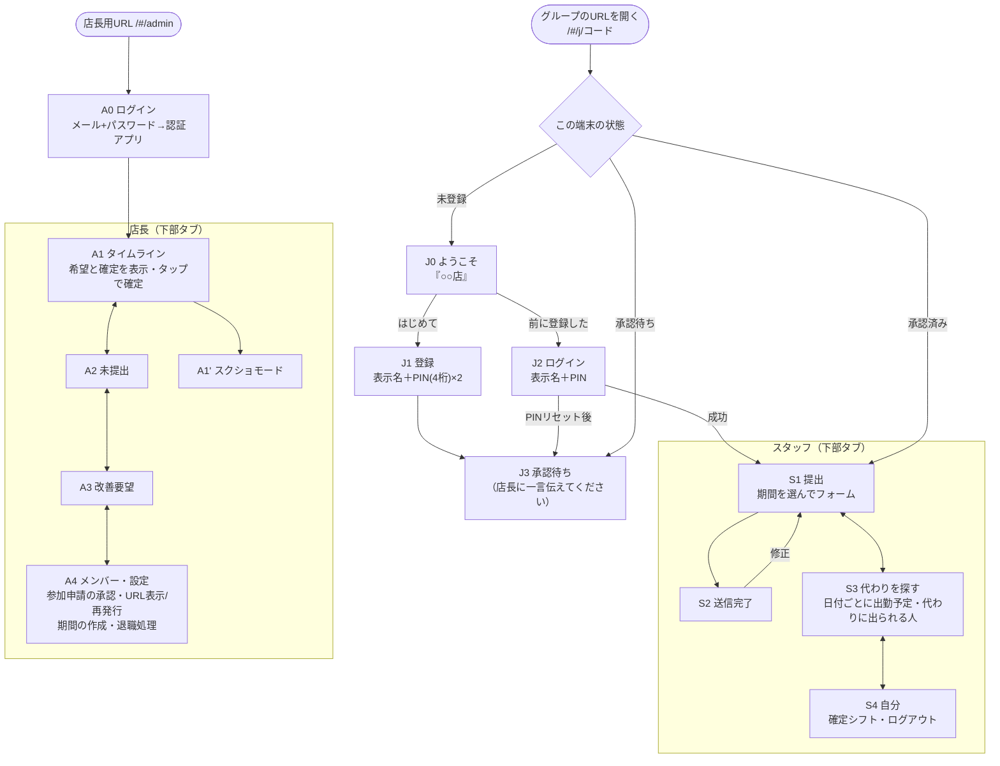

# シフト収集＆空き状況可視化システム 詳細設計書

| 項目 | 内容 |
| --- | --- |
| 対象 | 店舗のアルバイトシフト希望の収集・可視化・代わり探し（スマートフォン完結） |
| 利用者 | 管理者（店長）／スタッフ（アルバイト） |
| 版 | v0.3（2026-10-03） |
| 関連ファイル | 無料版: [`gas/Code.gs`](../gas/Code.gs)（スプレッドシート用バックエンド）・[`setup-free.md`](setup-free.md)（導入手順）／有料版: [`supabase/migrations/`](../supabase/migrations)（テーブル・RLS・RPC）／共通: [`app/`](../app)（画面） |

### 改訂履歴

| 版 | 変更内容 |
| --- | --- |
| v0.1 | 初版（スタッフごとの招待リンク方式。スタッフは他人の希望を閲覧不可） |
| v0.2 | ① **1日＝06:00〜翌02:00（営業日）** に変更。② スタッフごとの招待リンクを廃止し、**店長はグループチャットに店舗共通URLを1つ送るだけ**にした（表示名＋4桁PINで自己登録 → 店長が初回だけ承認）。③ 店長が**確定シフト**を登録できるようにした。④ スタッフが**「代わりに出られる人」（希望は出したが確定シフトに入っていない人）を閲覧できる**ようにした（公開するのは名前と時間帯のみ）。 |
| v0.3 | **完全無料の構成（Google スプレッドシート + Apps Script + Cloudflare Pages）を標準にした**。Supabase 版は有料の選択肢として残す。画面は共通で、接続先だけを切り替える（§1.0）。 |

## 0. 設計方針（要約）

- **作らないものは作らない。** 認証・DB・暗号化・バックアップは BaaS（Supabase）に任せ、自前で書くのは「画面」と「権限ルール（RLS）」だけにする。
- **店長の手間は「月1回、グループにURLを1つ貼る」だけ。** URLは店舗ごとに固定なので、毎回同じものを貼ればよい（チャットのピン留め・ノートに置いておいてもよい）。
- **連絡はチャットアプリのまま。** 本システムは通知を送らない。シフト募集の告知、未提出者への催促、欠勤時の相談は既存のグループチャットで行う。
- **個人情報は「表示名」だけ。** メールアドレス・電話番号・チャットアプリのIDは保存しない。
- **権限はDBで強制する。** 画面で隠すだけでなく、PostgreSQL の Row Level Security（RLS）と関数で公開範囲を決める。アプリにバグがあっても、決めた範囲を超えるデータは返らない。

### 0.1 営業日（1日の区切り）

- **1日 ＝ 06:00 〜 翌 02:00**（20時間）。たとえば「10/3 の 23:00〜翌1:00」は **10/3 のシフト**として扱う。
- 時刻は DB に「その営業日の 0:00 からの分」で保存する（06:00 = 360、24:00 = 1440、翌1:30 = 1530、翌2:00 = 1560）。日付をまたいでも開始 < 終了の比較が単純になり、5分刻みの検証も `分 % 5 = 0` で済む。
- 画面上の表記は「翌1:30」に統一する（タイムラインの目盛りも同じ）。
- 入力時の解釈：時刻ピッカーで **06:00 より前（00:00〜02:00）を選んだら翌日** とみなす。02:05〜05:55 は入力できない。

---

## 1. 推奨技術スタック・使用ツールと選定理由

### 1.0 構成の選択（v0.3: 無料版を標準に）

画面（`app/`）は共通で、データの保存先だけを環境変数 `VITE_BACKEND` で切り替える。

| | **無料版（標準）** | 有料版 |
| --- | --- | --- |
| データ保存 | Google スプレッドシート（店舗用 Google アカウントのドライブ） | Supabase（PostgreSQL、東京） |
| 処理・権限チェック | Google Apps Script のウェブアプリ（[`gas/Code.gs`](../gas/Code.gs)） | DB の RLS と関数 |
| 画面の配信 | Cloudflare Pages（無料） | 同左 |
| 費用 | **0円** | 約 $25/月 |
| スタッフの認証 | 表示名＋PIN → 端末トークン（ハッシュをシートに保存） | 匿名サインイン＋表示名＋PIN |
| 店長の認証 | パスワード＋認証アプリ（TOTP、Apps Script 内で検証） | メール＋パスワード＋TOTP（Supabase Auth） |
| 権限の守り方 | すべての読み書きを Apps Script の関数経由にし、関数内で検証（スプレッドシートは非共有） | DB の RLS で強制 |
| 応答速度 | 1〜3 秒 | 0.1〜0.5 秒 |
| 同時処理 | 約 30 件（書き込みはロックで 1 件ずつ。混雑時は画面が自動で再送） | 十分 |
| バックアップ | スプレッドシートの変更履歴（自動） | 日次バックアップ（Pro） |
| 導入手順 | [`setup-free.md`](setup-free.md) | [`app/README.md`](../app/README.md) |

**無料版でのセキュリティ上の追加対策**
- **数式インジェクション対策**：利用者が入力した文字列が `=` `+` `-` `@` で始まる場合は、先頭に `'` を付けて文字列として保存する。`=IMPORTXML(...)` などが数式として実行され、データが外部へ送られるのを防ぐ。
- **書き込みの直列化**：`LockService` を使い、書き込みは 1 件ずつ処理する。同時に送信されてもデータが壊れない。
- **秘密情報の分離**：店舗URLのコード・店長のパスワードのハッシュ・TOTP の秘密鍵・店長のセッションは、シートではなく Script Properties に保存する（シートを開いても見えない）。
- **PIN・パスワード**：ソルト付きの SHA-256 を 2,000 回反復してハッシュ化する。PIN は 4 桁で総当たりに弱いため、ロック（5 回失敗で 30 分、累計 10 回で店長のリセットまで）とシートの非共有で守る。
- **TOTP**：RFC 6238 準拠（30 秒、6 桁）。一度使ったコードの再利用を拒否する。店長のログインは 5 回失敗で 15 分ロックする。
- **テスト**：`gas/test/` で Apps Script の実行環境を模擬し、`Code.gs` をそのまま読み込んで権限シナリオを検証している（`node --test gas/test/*.test.mjs`）。

以下の §1.1〜§3 は有料版（Supabase）を前提に記述している。データモデルと権限の考え方は無料版も同じで、無料版ではテーブルをスプレッドシートのシートに置き換え、RLS と関数の役割を `Code.gs` の関数が担う。

### 1.1 構成図



### 1.2 採用ツール

| レイヤ | 採用 | 主な選定理由 |
| --- | --- | --- |
| DB・認証・API | **Supabase**（Pro プラン、東京リージョン） | PostgreSQL の **RLS** で行単位の権限分離をDB側で強制できる。認証（MFA・匿名サインイン）が組み込み。保存時暗号化（AES-256）・TLS・日次バックアップ。SOC 2 Type II。データを国内に置ける。 |
| フロントエンド | **React + TypeScript + Vite**（PWA） | 静的ファイルだけで動くので、サーバーの運用が不要。 |
| ジェスチャー | Pointer Events を直接使用 | タイムラインのピンチ操作。依存ライブラリを増やさない。 |
| ホスティング | **Cloudflare Pages** | 商用でも無料枠で足りる。HTTPS 自動。`_headers` でセキュリティヘッダを設定できる。 |
| ボット対策 | Cloudflare Turnstile（Supabase Auth の CAPTCHA 連携） | 匿名サインインと PIN 総当たりの乱用を防ぐ。 |
| 定期処理 | Supabase `pg_cron` | 退職者・古いデータの自動削除。 |

**コストの目安**：Supabase Pro 約 $25/月（複数店舗を収容可）＋ Cloudflare Pages 無料。

### 1.3 比較検討した他案

| 候補 | 評価 | 不採用理由 |
| --- | --- | --- |
| AppSheet / Glide | △ | スタッフ全員に Google アカウント（メールアドレス）でのログインが必要で、データ最小化に反する。縦＝時間・横＝スタッフのタイムラインやピンチ操作を自由に作れない。 |
| Kintone | △ | ユーザーごとにライセンス費用がかかり、アルバイト全員分だと割高。 |
| Bubble | △ | 権限ルールが独自形式で監査しにくい。データの保存場所を細かく選べない。 |
| Googleフォーム＋スプレッドシート | × | 本人確認ができない。共有設定のミスで全員分が見える。5分刻みの入力を強制できない。 |
| Firebase | ○（次点） | 同じ構成は作れるが、「期間×スタッフ×日」の集計や代わり探しの抽出は SQL の方が素直に書ける。 |
| LINE ミニアプリ / LIFF | △ | 不要な識別子（LINE のユーザーIDなど）を取得することになる。将来の拡張候補。 |

### 1.4 認証方式（「グループに1URL」とデータ最小化の両立）

| 利用者 | 方式 | 保存する情報 |
| --- | --- | --- |
| 店長 | メール＋パスワード ＋ **TOTP（認証アプリ）による多要素認証（必須）**。アカウントは運営側が発行し、一般のサインアップは無効にする。 | 店舗の業務用メールアドレス、表示名 |
| スタッフ | **店舗共通URL**を開く → **初回だけ**「表示名＋4桁PIN」で登録 → 店長が**承認（1タップ）** → 以後その端末ではログインしたまま | 表示名、PINのハッシュ（bcrypt） |

- **店舗共通URL** は `https://<app>/#/j/<32文字のコード>`。コードは 128bit の乱数。URL の `#` 以降はサーバーへ送られないため、アクセスログに残らない。初回アクセスの後は端末に保存し、ホーム画面のアイコンから開ける。
- **毎月の運用**：店長は募集期間を「受付中」にして、同じURLをグループに貼るだけ。スタッフは開けばすぐ提出フォームが出る（ログイン済みのため）。
- **機種変更・ブラウザのデータ消去**：「前に登録した方」から表示名＋PINで本人がログインし直す（店長の操作は不要）。ログインすると旧端末は自動でログアウトする。
- **PIN を忘れた・ロックされた**：店長が「ログインをリセット」を押す → 本人が新しいPINでログイン → 店長が再承認する。
- **なりすまし・総当たり対策**：
  - 登録は店長の承認が済むまで何もできない（提出も閲覧もできない）。心当たりのない申請は「却下」で削除できる。
  - PIN を5回間違えると30分ロック、累計10回で店長がリセットするまでロック（4桁でも突破確率は 0.1% 以下）。
  - 承認待ちが20件を超えたら新しい登録を受け付けない（URL が外部に漏れた場合の大量登録対策）。
  - URL が店外に漏れたときは、店長が「URLを再発行」すると旧URLは即座に無効になる（登録済みの端末はそのまま使える）。

---

## 2. データモデル

### 2.1 ER図



### 2.2 テーブル定義の要点

| テーブル | 役割 | 主な制約・設計判断 |
| --- | --- | --- |
| `stores` | 店舗（テナント） | すべての業務データは `store_id` で店舗ごとに分離する。 |
| `store_join_codes` | グループに貼る共通URLのコード | 読めるのは店長だけ。`rotate_join_code()` で再発行する。 |
| `members` | 店長・スタッフ | **個人情報は `display_name` のみ**。PINでログインするため、表示名は店舗内で一意にする（大文字小文字・前後の空白は区別しない）。`pin_hash` などPIN関連の列は列単位の権限で**誰にも読ませない**（関数の中でのみ照合する）。 |
| `shift_periods` | 募集期間 | 最大32日。`draft` はスタッフから見えない。`open` の間だけ提出・修正できる。 |
| `submissions` | 期間ごとの提出（1人1期間1件） | 再提出すると上書きされる。 |
| `submission_days` | 日別の可否と時間 | CHECK 制約で「休みなら時刻なし」「入れるなら 06:00 ≦ 開始 ＜ 終了 ≦ 翌02:00、5分刻み」をDBが保証する。期間外の日付は RPC で拒否する。 |
| `shift_assignments` | 確定シフト | 1人1営業日に1枠。店長だけが作成・変更でき、期間内の日付で、同じ店舗の承認済みスタッフであることを RLS で検証する。 |
| `feedback` | サイト改善案 | **投稿者を記録しない（匿名）**。 |
| `audit_logs` | 操作の記録 | 登録・承認・ログイン失敗・退職処理・URL再発行などを記録する。氏名は書かず、IDだけを残す。 |

### 2.3 「代わりに出られる人」の判定

`availability_board(period_id)` が、期間内の各営業日について次の行を返す（呼び出せるのは同じ店舗の承認済みメンバー）。

| 列 | 内容 |
| --- | --- |
| `display_name` | 表示名 |
| `avail_start` / `avail_end` | 提出した「入れる」時間帯（なければ NULL） |
| `assign_start` / `assign_end` | 確定シフト（なければ NULL） |
| `is_me` | 自分の行か |

画面では、選んだ日を次の3つに分けて表示する。

1. **出勤予定**：確定シフトがある人
2. **代わりに出られる人**：「入れる」と提出しているが、確定シフトがない人（＋確定シフトより長く入れる人は「◯時以降も可」と表示）
3. （自分が出勤予定なら）自分の時間帯と重なる人を上に並べ、重なっている時間を表示する

**公開しないもの**：日別の備考、期間全体の備考、「休み」と提出した事実、未提出かどうか。理由が書かれがちな備考は、本人と店長だけが見られる。

### 2.4 データ保持期間（自動削除）

| データ | 保持期間 | 削除方法 |
| --- | --- | --- |
| 退職処理済みスタッフ | 退職処理から30日（誤操作の取り消し猶予） | `pg_cron` で日次削除（提出・確定シフトも連鎖削除）。「今すぐ完全削除」も可能。 |
| 承認されなかった登録申請 | 申請から30日 | `pg_cron` |
| 募集期間・提出・確定シフト | 期間終了から180日 | `pg_cron` |
| 改善要望・操作ログ | 1年 | `pg_cron` |
| どの店舗にも紐付いていない匿名アカウント | 作成から7日 | Supabase Auth の管理 API を Edge Function から日次実行 |

---

## 3. セキュリティ対策の実装方針

### 3.1 要件との対応表

| 要件 | 実装 |
| --- | --- |
| 個人情報の最小化 | 個人情報の列は `display_name` だけ。電話・住所・生年月日・メールの列はスキーマに存在しない（店長のメールは認証基盤側のみ）。改善要望は匿名。外部の解析タグは入れない。 |
| 権限分離 | `members.role`（admin / staff）と RLS。店長の権限は **MFA を済ませたセッション（`aal2`）であること**を条件にしている。 |
| スタッフが提出できるのは自分の分だけ | 書き込みは `submit_shift` 関数経由のみ。提出者はクライアントから受け取らず、ログイン情報（`auth.uid()`）から決める。 |
| 他人の情報の公開範囲（v0.2 で変更） | 他のスタッフについて見えるのは、`availability_board` が返す**表示名・入れる時間帯・確定シフト**だけ。提出テーブル・備考・メンバー一覧を直接読むことはできない（RLS で本人と店長に限定）。 |
| 店長だけが全体を閲覧 | 備考付きのタイムライン、未提出者、改善要望、メンバー管理は `is_store_admin()` を満たす場合だけデータが返る。 |
| 通信の暗号化 | Cloudflare Pages・Supabase ともに HTTPS のみ。HSTS を付ける。DB への直接接続は SSL を必須にする。 |
| 保存データの保護 | Supabase の保存時暗号化（AES-256）。東京リージョン。PIN は bcrypt でハッシュ化する。 |
| 退職者の無効化・削除 | 「退職処理」で即座にアクセスできなくなり、今後の確定シフトも外れる。30日後に自動で完全削除する（即時削除も可）。 |

> **要件変更の記録（v0.2）**：当初の要件「スタッフは他人のシフト希望にアクセスできない」は、欠勤時の代わり探しのために緩和した。ただし公開範囲は「同じ店舗の承認済みスタッフ」に限り、公開項目は名前と時間帯だけにして、備考は対象外とした。導入時の説明資料で、スタッフにこの公開範囲を周知する。

### 3.2 RLS ポリシー一覧

基本方針：**全テーブルで RLS を有効にし、`anon` ロールには一切の権限を与えない。書き込みは原則 `SECURITY DEFINER` の関数に集約する。** 関数は入力値と権限をすべて自分で検証し、`search_path` は空に固定する。

| テーブル | SELECT | INSERT / UPDATE / DELETE |
| --- | --- | --- |
| `stores` | 承認済みメンバー | 関数 `create_store` のみ |
| `store_join_codes` | 店長 | 関数 `create_store` / `rotate_join_code` のみ |
| `members` | 自分の行（承認待ちでも可）／店長。**PIN関連の列は誰も読めない** | UPDATE は店長が `display_name` と `sort_order` の列だけ。それ以外は関数 |
| `shift_periods` | 承認済みメンバー（`draft` は店長のみ） | 店長 |
| `submissions` / `submission_days` | 本人／店長 | 関数 `submit_shift` のみ |
| `shift_assignments` | 本人／店長 | 店長（期間内の日付・同じ店舗・承認済みスタッフであることを検証） |
| `feedback` | 店長 | 関数 `submit_feedback` のみ |
| `audit_logs` | 店長 | 関数の内部でのみ記録 |

主な関数：

| 関数 | 呼び出せる人 | 処理 |
| --- | --- | --- |
| `store_by_code(code)` | URLを開いた端末 | 店舗名を返す（登録画面の表示用） |
| `register_member(code, name, pin)` | URLを開いた端末 | 承認待ちのメンバーとして登録する |
| `login_member(code, name, pin)` | URLを開いた端末 | PINを照合して端末を付け替える。失敗回数を数え、ロックする |
| `logout_member()` | スタッフ | この端末からログアウトする（共用端末向け） |
| `approve_member` / `reject_member` / `reset_member_login` | 店長 | 承認／却下／PINのリセット |
| `rotate_join_code()` | 店長 | 共通URLを再発行する |
| `submit_shift(period_id, note, days)` | 承認済みスタッフ | 受付中か、日付が期間内かを検証し、提出内容を置き換える |
| `availability_board(period_id)` | 承認済みメンバー | 代わり探し用に、名前・時間帯・確定シフトだけを返す |
| `unsubmitted_members(period_id)` | 店長 | 未提出者の一覧 |
| `retire_member` / `restore_member` / `delete_member_now` | 店長 | 退職処理／取り消し／即時完全削除 |
| `submit_feedback(body)` | 承認済みメンバー | 改善要望を匿名で登録する |
| `purge_expired_data()` | `pg_cron` のみ | 保持期間を過ぎたデータを削除する |

### 3.3 アプリケーション層の対策

- **鍵の管理**：フロントエンドには公開用の `anon` キーだけを置く（RLS があるので公開されても問題ない）。`service_role` キーはリポジトリに入れない。
- **セキュリティヘッダ**（`app/public/_headers`）：CSP（`default-src 'self'`、通信先は Supabase と Turnstile のみ、`frame-ancestors 'none'`）、HSTS、`Referrer-Policy: no-referrer`、`X-Content-Type-Options: nosniff`、`Permissions-Policy`。
- **XSS**：備考や改善案は React のテキストとして描画し、`dangerouslySetInnerHTML` は使わない。DB 側でも文字数の上限を設けている。
- **セッション**：Supabase Auth の Refresh Token Rotation を有効にする。退職処理・ログインのリセット・別端末でのログインをすると、その時点で RLS により旧端末からのアクセスはできなくなる。
- **乱用対策**：匿名サインインに Turnstile を必須にする。PIN の総当たりはロックで防ぐ。
- **依存ライブラリ**：本体の依存は `react`、`react-dom`、`@supabase/supabase-js` だけにする。Dependabot と `npm audit` を CI で実行する。

### 3.4 退職者対応フロー



### 3.5 運用上のルール（導入時に店舗へ渡す）

1. 表示名は「名字＋名の頭文字」など、店舗内で区別できる最小限のものにする。
2. 登録申請に心当たりがなければ承認しない（「却下」する）。
3. スタッフ以外がいるグループに URL が流れた場合は「URLを再発行」する。
4. 店長の交代時は、新店長の管理者アカウントを発行してから旧店長のアカウントを無効化する。

### 3.6 検証

- `scripts/test-db.sh`：ローカルの PostgreSQL にマイグレーションを適用し、`supabase/tests/rls_scenarios.sql` を実行する。次のような項目を確認している。
  - 承認待ちのスタッフは何も見えない
  - 他のスタッフの備考や提出テーブルは見えず、名前と時間帯だけが見える
  - PIN の列は読めない
  - 06:00 より前・翌02:00 より後・5分刻みでない時刻は拒否される
  - PIN を5回間違えるとロックされる
  - 別の端末でログインすると旧端末はログアウトされる
  - MFA を済ませていない店長は何も見えない
  - 退職処理をすると即座にアクセスできなくなる
  - URL を再発行すると旧URLは無効になる
- リリース前に Supabase の Security Advisor で警告がゼロであることを確認する。

---

## 4. 主要な画面遷移図（UIフロー）

### 4.1 毎月の運用（店長の作業は2つだけ）



### 4.2 全体の画面遷移



### 4.3 S1 スタッフ向け：シフト提出フォーム（Googleフォーム風）

縦スクロールのみ。1列にカードを並べる。

```
┌──────────────────────────┐
│ ○○店  山田さん              │
├──────────────────────────┤
│ 対象期間                     │
│ [ 10月前半 (10/1〜10/15) ▼ ] │  ← 受付中の期間のみ
│ 締切: 9/25(木) 23:59          │
├──────────────────────────┤
│ 10/1 (水)                    │
│  [  休み  ] [■ 入れる ]      │  ← 2択（未選択も可）
│  ┌ 開始 [ 17:05 ]           │  ← 「入れる」の時だけ展開
│  └ 終了 [ 1:30 ] 翌1:30     │     タップでネイティブのドラムロール
│  備考（任意・店長のみ閲覧）  │
├──────────────────────────┤
│   … 期間の日数分 …           │
├──────────────────────────┤
│ 期間全体の備考（任意）       │
├──────────────────────────┤
│ 💡 このサイトの改善案を募集  │  ← 必ず最下部に置く（匿名と明記）
├──────────────────────────┤
│ [        送信する        ]   │  ← 画面下に固定
└──────────────────────────┘
```

- **時刻入力**：`<input type="time" step="300">` で端末標準のドラムロールを出す。06:00 より前を選んだら「翌」を付けて表示し、翌日として保存する。02:05〜05:55 はエラーにする。iOS Safari は `step` を無視して1分刻みのホイールを出すため、**入力後に最も近い5分へ丸めて**「17:03 → 17:05 に調整しました」と表示する。最終的な5分刻みの保証は DB の CHECK 制約で行う。
- **入力補助**：「前の日と同じ」ボタン。入力途中の内容は端末の `localStorage` に下書きとして保存する。
- **未選択の日**：送信時に「◯日が未選択です。休みとして送信しますか？」と確認する。

### 4.4 S3 スタッフ向け：代わりを探す

```
┌──────────────────────────┐
│ 代わりを探す   10月前半 ▼    │
│ ◀  10/3 (金)  ▶              │  ← 日付の切り替え（左右スワイプも可）
├──────────────────────────┤
│ あなたの確定: 17:00〜22:00   │
├──────────────────────────┤
│ 代わりに出られる人           │
│  佐藤  16:00〜翌1:00         │
│        ▸ あなたの時間と全部重なる │
│  鈴木  18:00〜22:00          │
│        ▸ 18:00〜22:00 が重なる │
├──────────────────────────┤
│ 出勤予定                     │
│  山田（あなた）17:00〜22:00  │
│  田中  10:00〜17:00          │
└──────────────────────────┘
```

- ここからチャットへ直接連絡はしない（連絡は既存のグループチャットで行う）。

### 4.5 A1 店長向け：空き状況タイムライン

```
┌───────────────────────────┐
│ ◀ 10/3(金) ▶  10月前半   📷 │
├────┬─────┬─────┬─────┬────┤
│     │山田 │佐藤 │鈴木 │田中│  ← 上部に固定
├────┼─────┼─────┼─────┼────┤
│ 6:00│     │     │     │ 未 │
│ …  │     │░░░░░│     │ 提 │
│17:00│▓▓▓▓▓│░░░░░│     │ 出 │  ░ = 希望（入れる）
│ …  │▓確定▓│░░░░░│░░░░░│    │  ▓ = 確定シフト
│24:00│     │░░░░░│     │    │
│翌1:00│    │░░░░░│     │    │
│翌2:00│    │     │     │    │
├────┴─────┴─────┴─────┴────┤
│ [タイムライン] [未提出] [改善要望] [メンバー] │
└───────────────────────────┘
```

- **軸**：縦軸＝時間（既定は **06:00〜翌02:00**、期間ごとに変更可）、横軸＝スタッフ（`sort_order` 順）。時刻の列は左に、名前の行は上に固定する。
- **表示**：希望（入れる）＝淡い色のバー、確定シフト＝濃い色のバー（希望バーの上に重ねる）。未提出＝列全体を薄いグレーにして「未提出」と表示。備考がある日は 💬 を表示し、タップで全文を出す。
- **確定シフトの登録**：希望バーをタップ → 「この時間で確定」（開始・終了は変更可）／「確定を外す」。
- **ピンチ操作**：Pointer Events で2本指の距離を測り、「1分あたりのピクセル数」を変えて描画し直す（倍率 0.4〜4 倍）。CSS の `scale` で拡大すると文字がぼやけるため使わない。目盛りは倍率に応じて 1時間 → 30分 → 15分 → 5分 と細かくする。ブラウザのズームはこの描画エリア内だけ `touch-action: pan-x pan-y` で抑える。
- **スクショモード（📷）**：タブやボタンを隠し、その日の全時間帯が1画面に収まる倍率に自動で合わせる。上部に「○○店 10/3(金) 空き状況（作成時刻）」を表示する。配色は白背景＋青系＋グレーに固定する（ダークモードの端末でも同じ見た目にする）。

### 4.6 A2〜A4

- **A2 未提出**：期間を選ぶと一覧を表示する。「名前をコピー」で「未提出: 山田、田中」をクリップボードにコピーし、グループでの催促に貼れる。
- **A3 改善要望**：新しい順のカード一覧（日時と本文のみ）。
- **A4 メンバー・設定**：
  - **参加申請**：承認／却下。新しい申請があればタブにバッジを表示する。
  - **グループ用URL**：表示・コピー・端末の共有シートで送信・再発行。
  - **募集期間**：作成と状態の切り替え（下書き → 受付中 → 締切）。
  - **メンバー**：状態の表示、ログインのリセット、退職処理（確認のため表示名の入力を求める）、元に戻す、完全削除。

---

## 5. 実装状況とロードマップ

| フェーズ | 内容 | 状況 |
| --- | --- | --- |
| 1 | DB スキーマ・RLS・関数、権限シナリオテスト | 済（`scripts/test-db.sh`） |
| 2 | 画面（スタッフ S1〜S4、店長 A0〜A4）。Supabase がなくても動く**デモモード**付き | 済（`app/`） |
| 3 | 無料版バックエンド（`gas/Code.gs`）と導入手順書（`setup-free.md`）。ローカルの模擬環境でシナリオテストと画面の通し確認 | 済 |
| 4 | 店舗用 Google アカウントでの導入、Cloudflare Pages への公開、1店舗での試験運用 | 未 |
